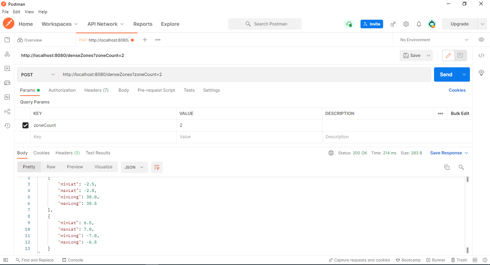

# Building the application

mvn clean install

# Lanching the application

mvn spring-boot:run

# Description

This project read data from csv with format
```
@id @lat @lon
id1 -48.6 -37.7
id2 -27.1 8.4
id3 6.6 -6.9
id4 -2.3 38.3
id5 6.8 -6.9
id6 -2.5 38.3
id7 0.1 -0.1
id8 -2.1 38.1
```
Each line is one POI:
```
Poi {
  String id;
  float latitude;
  float longitute;
}
```
each POI is located in one zone
```
Zone {
float minLat;
float maxLat;
float minLong;
float maxLong;
}
```
```
maxLat = minLat + 0.5;
maxLong = minLong + 0.5;
```
# Testing the application
- This is spring boot application. After starting the application at localhost.

- Open Postman

- New http request with POST as method

- To calculate density : http://localhost:8080/density?minLat=6.5&minLong=-7.0
  

- To get most dense zones : http://localhost:8080/denseZones?zoneCount=2
  
